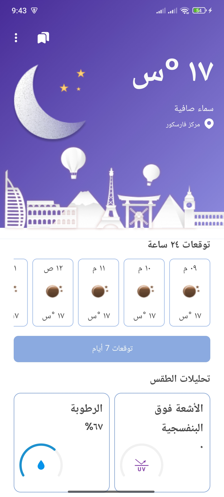
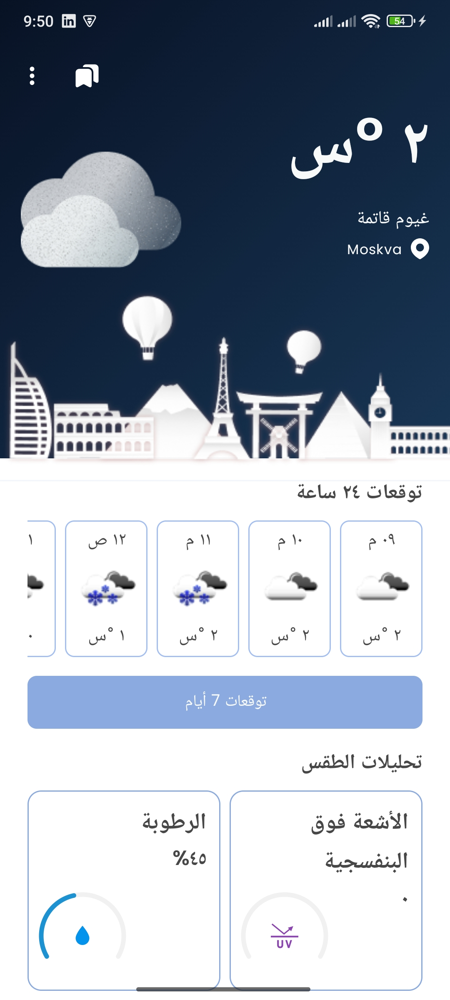
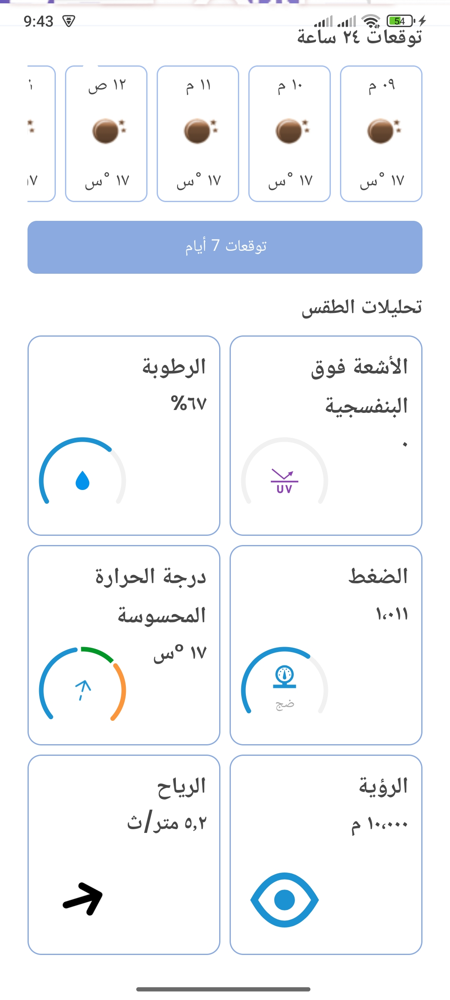
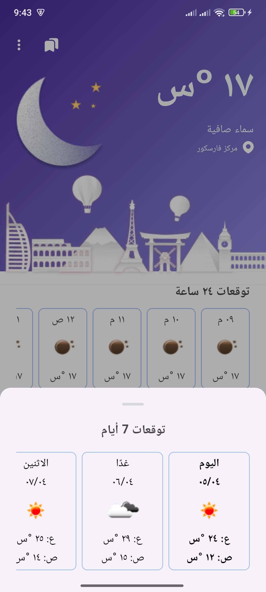
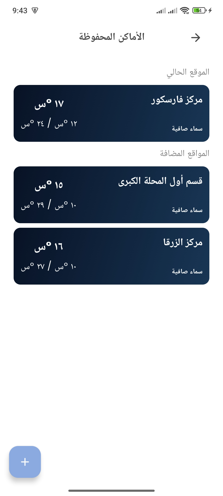
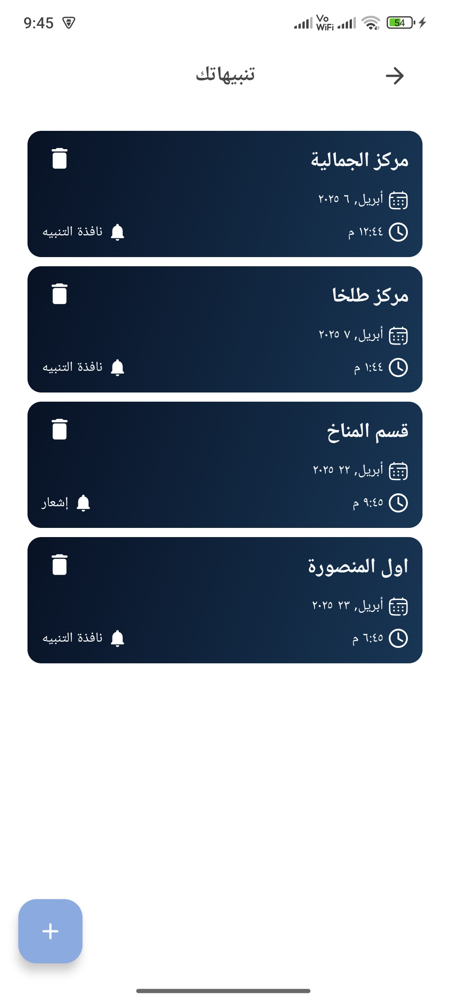
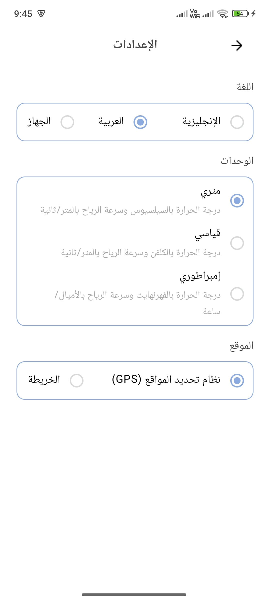

# Sky Sense 

A modern weather forecast app that provides real-time weather updates and detailed forecasts.Stay informed with current conditions, hourly updates, and 5-day outlooks. Customize your experience with alerts, favorites, and multilingual support.

Available on MediaFire Store

## Screenshots

   
   
   
   
  
  
  

### 🧑🏻‍💻 Android development

- Application is written with [Kotlin](https://kotlinlang.org/docs/home.html)
- UI is written using [Jetpack Compose](https://developer.android.com/develop/ui/compose/documentation)
- Following the [Material You](https://m3.material.io/) guidelines
- Asynchronous processing using [Coroutines](https://kotlin.github.io/kotlinx.coroutines/)
- Architectural pattern using [MVVM](https://developer.android.com/topic/architecture)
- Caching using [Room](https://developer.android.com/topic/libraries/architecture/room)
- Data stream using [Kotlin Flows](https://developer.android.com/kotlin/flow)
- Maps SDK using [Google Maps](https://developers.google.com/maps/documentation/android-sdk/start)
- Search for places using [Places SDK](https://developers.google.com/maps/documentation/places/android-sdk/overview)
- App Preferences using [Shared Preferences](https://www.geeksforgeeks.org/shared-preferences-in-android-with-examples/)

### Features ✨

- Real-Time Weather Updates with temperature, humidity, wind speed, pressure, clouds, and more.
- Dynamic Weather Icons and Descriptions based on live conditions.
- Hourly Weather Forecasts and Detailed 7-Day Outlooks.
- Add Cities via Map Selection or Search for accurate location targeting.
- Manage Favorite Locations to quickly check weather for saved places.
- Set Custom Weather Alerts for specific conditions, time, and date.
- Receive Timely Notifications with options to snooze, dismiss, or cancel.
- Choose Between GPS or Manual Location for flexible weather tracking.
- Switch Between Units (°C, °F, Kelvin) and Wind Speeds (m/s, mph).
- Multilingual Support with full English and Arabic localization.
- Seamless and User-Friendly Interface with smooth navigation across screens.
  

## Find this repository useful? :heart:
Support it by putting a star for this repository. :star:  
Also, __[follow me](https://github.com/3wiida)__ on GitHub for my next creations! 🤩
